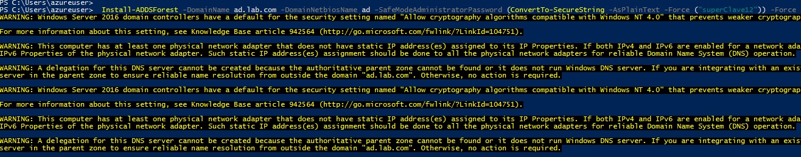
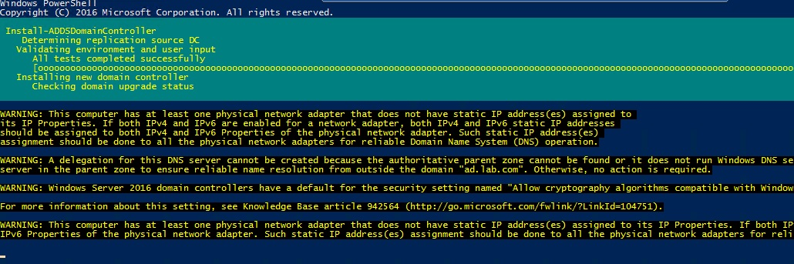
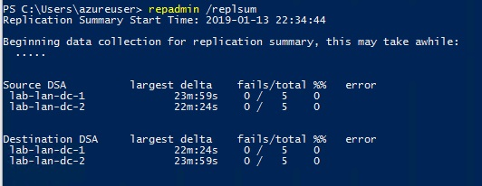
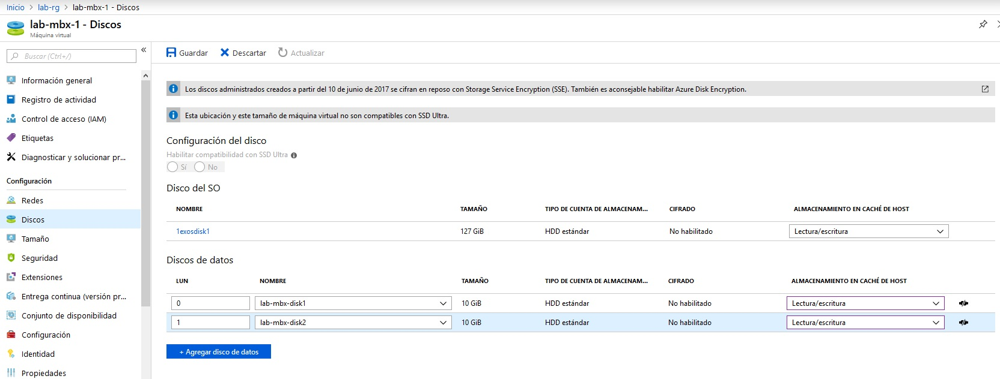
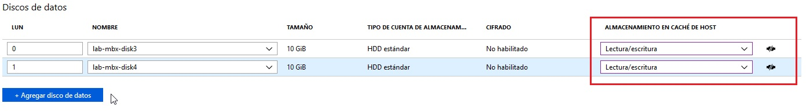
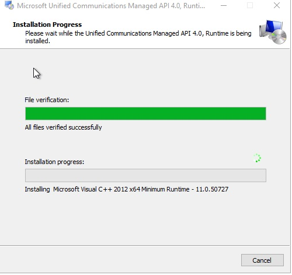

#### Terraform + Azure + Active Directory + Exchange 
En el siguiente laboratorio vamos a implementar una Exchange 2016 en alta disponibilidad en Azure mediante terraform. Este deploy contiene herramientas de alta disponibilidad como Azure Load Balancing, IIS AAR, DFSR y Exchange DAG (Database  Availability Group).

Crearemos 5 VMs con Windows Server 2016 en una virtual Network con dos subnets: una subnet de DMZ y una subnet de LAN.

##### Tabla de contenidos
1. [Definiciones de Arquitectura](Arquitectura)
2. [Requisitos](#Requisitos)
3. [Preparación](#Preparación)

##### Arquitectura
*	Utilizaremos Azure Load Balancers para balancear el tráfico a nuestros servidores IIS ARR.
*	Los servidores IIS ARR (en DMZ) serán proxy reversos y además balancearan el tráfico a los servidores Exchange 2016.
*	Los servidores Exchange 2016 replicaran las bases de datos mediante DAG.
*	Adicionalmente utilizaremos DFSR para replicar la configuración de IIS entre los dos servidores proxy reversos (IIS ARR).


##### Requisitos
*	Poseer subscripción de Azure.
*	Descargar terraform e instalar Terraform
*   Descargar carpeta TFExchangeLAB

---
#### Laboratorio:
**1- Preparación:**
* Desde consola (cmd/bash/powershell) Ir a la carpeta [TFExchangeLAB](https://github.com//TFExChangeLab) y ejecutar el comando:
```Powershell
    Terraform init 
```

*	Ejecutar validación y verificar que no hay errores: 
```powershell
    Terraform validate 
```

* Deploy de infraestructura. Puede demorar entre 5 a 10 minutos.
```powershell
    Terraform apply -auto-approve
 ```
 
* Ingresar al [Portal de Azure](https://portal.azure.com) y verificar creación de recursos.
 

* Si el deploy es correcto, en su consola obtendrán la IP Publica que les fue asignada:

* Ingresar por RDP a dicha IP con el puerto default: 3389.

**2- Active Directory:**
* Ya nos conectamos por RDP a una de las dos IP publicas y esto nos permitió ingresar a uno de los dos servidores WEB DMZ, desde este servidor nos conectaremos a los demás servidores.
*	Poseemos dos VMs que serán destinadas a controladores de dominio:
    *	LAB-LAN-DC-1 (10.0.2.5)
    *	LAB-LAN-DC-2 (10.0.2.6)
* Ingresar al servidor **10.0.2.5** y abrir powershell, ejecutar lo siguiente:
```Powershell
   Install-WindowsFeature AD-Domain-Services -IncludeManagementTools
```
* Crear el forest: en el servidor lab-dc1 ejecutar el siguiente comando. El equipo se reiniciará de manera automática. 
```Powershell
    Install-ADDSForest -DomainName ad.lab.com -DomainNetbiosName ad -SafeModeAdministratorPassword (ConvertTo-SecureString -AsPlainText -Force ("superClave12")) -Force
```


* Esto creará el forest y el equipo se reiniciara:
    * Nombre forest: ad.lab.com
    * Nombre Dominio: ad.lab.com
    * Nivel funcional de Forest: Windows Server 2016
    * Nombre NetBios: ad
  
* Ingresar al servidor **10.0.2.6**, unirlo al dominio y instalar el rol ADDS.
* El servidor se reiniciará, ingresar con administrador de dominio y ejecutar el siguiente comando para agregarlo como controlador de dominio:
```Powershell
    Install-ADDSDomainController -DomainName ad.lab.com -SafeModeAdministratorPassword (ConvertTo-SecureString -AsPlainText -Force "superClave12") -Force
```


**Nota**: Generalmente en producción tendremos un disco adicional donde apuntaremos la base de datos de AD y el SYSVOL, en este caso al ser un laboratorio  lo instalamos directamente en el disco C.

##### Modificacion de sitios y creación de subnets:
```Powershell
    Get-ADReplicationSite | Rename-ADObject -NewName "LAN"
    New-ADReplicationSubnet -Name "10.0.2.0/24" -Location LAN
    New-ADReplicationSubnet -Name "10.0.1.0/24" -Location LAN
```

###### Verificación:
```Powershell
    Get-ADReplicationSubnet -Fiter * 
```

* Verificación de replicación.
```Powershell
    repadmin /replsum

* Activación de papelera de reciclaje

```Powershell
  Enable-ADOptionalFeature 'Recycle Bin Feature' -Scope ForestOrConfigurationSet -Target ad.lab.com
```
**Nota** Remplazar el *target* con el nombre de dominio que han colocado anteriormente.

* SYSVOL: por default a partir de Windows Server 2008R2 el metodo de replicación es DFSR, por lo que no haremos ningún cambio.
---
### Exchange
En el deploy, creamos cuatro discos adicionales para atacharlos a los servidores Exchange con el objetivo de ubicar los binarios de instalación y las bases de datos.
1- Ingresar al portal de Azure, buscar el recurso: **lab-mbx-1**, dirigirse a la pestaña de discos:

Agregaremos los discos **lab-mbx-disk1** y **lab-mbx-disk2**, seleccionamos *Guardar* para atachar los discos. Debemos verificar que la opción "Administración en cache de host sea "Lectura y Escritura".

Repetir lo mismo con el servidor **lab-mbx-2** y los discos **lab-mbx-disk3** y **lab-mbx-disk4**.
2- Debemos inicializar y formatear los discos recien agregados, para ello ejecutar:

```Powershell
Get-Disk | Where partitionstyle -eq 'raw' | Initialize-Disk -PartitionStyle GPT -PassThru | New-Partition -AssignDriveLetter -UseMaximumSize | Format-Volume -FileSystem NTFS -Confirm:$false
```

* Paso siguiente: Unir ambos equipos al dominio y reiniciar. En mi caso el dominio es: ad.lab.com.
* Ingresar al servidor 10.0.2.20 con usuario administrador de dominio y descargar los siguientes pre requisitos:
**NOTA** Recomiendo deshabilitar la configuración de seguridad de IE para evitar advertencias de seguridad al utilizar el internet explorer en internet.
* Prerequisitos: [Documentación oficial](https://docs.microsoft.com/en-us/exchange/plan-and-deploy/prerequisites?view=exchserver-2016#exchange-2016-prerequisites-for-preparing-active-directory)
    a. [Microsoft .NET Framework 4.7.1 ](https://www.microsoft.com/en-us/download/details.aspx?id=56116)
    b [Visual C++ Redistributable Packages for Visual Studio 2013](https://www.microsoft.com/en-us/download/details.aspx?id=40784)
    c. [Microsoft Unified Communications Managed API 4.0, Core Runtime 64-bit](https://www.microsoft.com/en-us/download/details.aspx?id=34992)
    d. [Exchange 2016 CU11](https://www.microsoft.com/en-us/download/details.aspx?id=57388)
    f. Instalar los siguientes roles y features en cada servidor: 
```Powershell
    Install-WindowsFeature NET-Framework-45-Features, Server-Media-Foundation, RPC-over-HTTP-proxy, RSAT-Clustering, RSAT-Clustering-CmdInterface, RSAT-Clustering-Mgmt, RSAT-Clustering-PowerShell, WAS-Process-Model, Web-Asp-Net45, Web-Basic-Auth, Web-Client-Auth, Web-Digest-Auth, Web-Dir-Browsing, Web-Dyn-Compression, Web-Http-Errors, Web-Http-Logging, Web-Http-Redirect, Web-Http-Tracing, Web-ISAPI-Ext, Web-ISAPI-Filter, Web-Lgcy-Mgmt-Console, Web-Metabase, Web-Mgmt-Console, Web-Mgmt-Service, Web-Net-Ext45, Web-Request-Monitor, Web-Server, Web-Stat-Compression, Web-Static-Content, Web-Windows-Auth, Web-WMI, Windows-Identity-Foundation, RSAT-ADDS
```
**NOTA** Es posible que .NET Framework ya esté instalado en el servidor.
* Instalar UCMA.

4- Configurar
