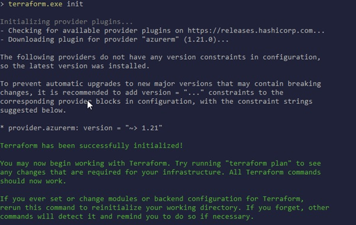
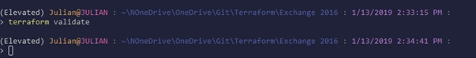
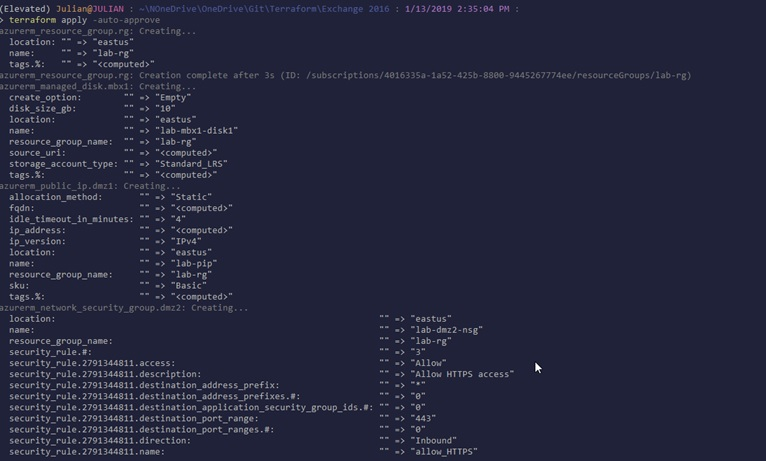
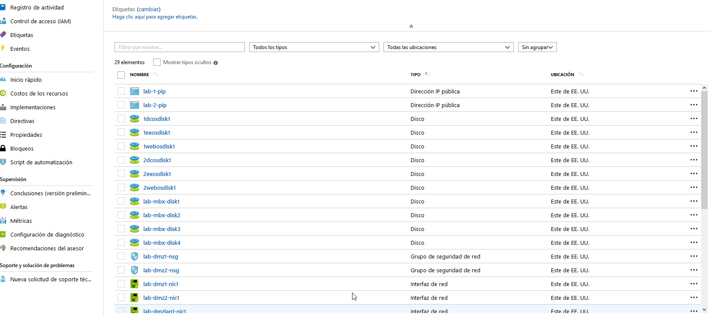
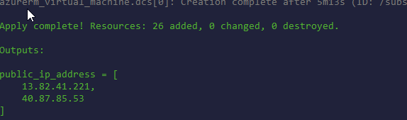

#### Terraform + Azure + Active Directory + Exchange
En el siguiente laboratorio vamos a implementar una Exchange 2016 en alta disponibilidad en Azure mediante terraform. Este deploy contiene herramientas de alta disponibilidad como Azure Load Balancing, IIS AAR, DFSR y Exchange DAG (Database  Availability Group).

Crearemos 5 VMs con Windows Server 2016 en una virtual Network con dos subnets: una subnet de DMZ y una subnet de LAN.


#####1- Definiciones de Arquitectura:
*	Utilizaremos Azure Load Balancers para balancear el tráfico a nuestros servidores IIS ARR.
*	Los servidores IIS ARR (en DMZ) serán proxy reversos y además balancearan el tráfico a los servidores Exchange 2016.
*	Los servidores Exchange 2016 replicaran las bases de datos mediante DAG.
*	Adicionalmente utilizaremos DFSR para replicar la configuración de IIS entre los dos servidores proxy reversos (IIS ARR).


#####2- Requisitos:
*	Poseer subscripción de Azure.
*	Descargar terraform e instalar Terraform
*   Descargar carpeta TFExchangeLAB


---
#### Laboratorio:
**1- Preparación:**
* Desde consola (cmd/bash/powershell) Ir a la carpeta [TFExchangeLAB](https://github.com//TFExChangeLab) y ejecutar el comando:
```Powershell
    Terraform init 
```

*	Ejecutar validación y verificar que no hay errores: 
```powershell
    Terraform validate 
```

* Deploy de infraestructura. Puede demorar entre 5 a 10 minutos.
```powershell
    Terraform apply -auto-approve
 ```
 
* Ingresar al [Portal de Azure](https://portal.azure.com) y verificar creación de recursos.
 

* Si el deploy es correcto, en su consola obtendrán la IP Publica que les fue asignada:

* Ingresar por RDP a dicha IP con el puerto default: 3389.

**2- Active Directory:**
* Ya nos conectamos por RDP a una de las dos IP publicas y esto nos permitió ingresar a uno de los dos servidores WEB DMZ, desde este servidor nos conectaremos a los demás servidores.
*	Poseemos dos VMs que serán destinadas a controladores de dominio:
    *	LAB-LAN-DC-1 (10.0.2.5)
    *	LAB-LAN-DC-2 (10.0.2.6)
* Ingresar al servidor **10.0.2.6** y abrir powershell, ejecutar lo siguiente:
```Powershell
   Install-WindowsFeature AD-Domain-Services -IncludeManagementTools
```
* Crear el forest: en el servidor lab-dc1 ejecutar el siguiente comando. El equipo se reiniciará de manera automática. 
    * Comando: 
```Powershell
        Install-ADDSForest -DomainName ad.lab.com -DomainNetbiosName ad -SafeModeAdministratorPassword (ConvertTo-SecureString -AsPlainText -Force ("superClave")) -Force
```

* Esto creará el forest:
        * Nombre forest: ad.lab.com
        * Nombre Dominio: ad.lab.com
        * Nivel funcional de Forest: Windows Server 2016
        * Nombre NetBios: AD
* Agregar segundo controlador de dominio:
  * En el servidor LAB-DC2 ejecutar el siguiente comando:

**Nota**: Generalmente en producción tendremos un disco adicional donde apuntaremos la base de datos de AD y el SYSVOL, en este caso al ser un laboratorio  lo instalamos directamente en el disco C.


3- Exchange
*	Unir ambos equipos al dominio y reiniciar. En mi caso el dominio: ad.lab.com


4- Configurar
